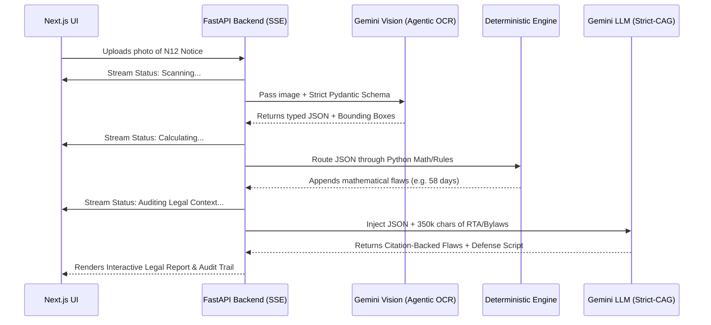

# 🏛️ Tenant Defender
### Strict-CAG Legal Evaluation Engine for Ontario Renters


> **Built for the GenAI Genesis 2026 Hackathon**
> *Empowering vulnerable renters with zero-hallucination, citation-backed legal defense against bad-faith evictions.*

---

## 📖 Overview

When a tenant receives an N12 eviction notice, they are often panicked, unaware of their rights, and unable to afford immediate legal counsel. While standard LLMs can offer generic advice, they notoriously **hallucinate dates, math, and specific statutory citations**—making them dangerous for real legal defense.

**Tenant Defender** solves this by implementing a **Strict Context-Augmented Generation (Strict-CAG)** architecture. It combines the multimodal extraction power of Vision-Language Models with the mathematical certainty of deterministic Python logic, wrapped in a massive context window containing the exact text of the Ontario Residential Tenancies Act (RTA) and local municipal bylaws.

### 🚀 Key Capabilities

* **👁️ Agentic OCR & Visual Audit Trail:** Uses Gemini 2.5 Flash's multimodal capabilities to visually scan messy, photographed eviction notices. It extracts data into a strict Pydantic JSON schema and returns spatial bounding boxes, dynamically highlighting the exact checkbox or date on the UI to build user trust.
* **🧮 Deterministic Pre-Processing (Neuro-Symbolic Gate):** Bypasses LLM math hallucinations entirely. The Python backend calculates termination notice periods (the "60-day rule") and routes municipal bylaws (e.g., Kitchener's Shared Accommodation License) before the AI even interprets the law.
* **📚 High-Context Legal Reasoning:** Injects the Ontario RTA and local municipal codes directly into the active memory of the LLM, forcing the model to evaluate the notice exclusively against provided statutes.
* **⚡ Progressive Disclosure UI:** Utilizes Server-Sent Events (SSE) to stream the asynchronous backend execution log directly to the React frontend, allowing the user to watch the AI verify facts in real-time.

---

## 🛠️ Architecture & Tech Stack



### The Tech Stack

| Component | Technology | Role |
| --- | --- | --- |
| **Frontend** | **Next.js + Tailwind** | "Professional Editorial" UI using Server-Side Rendering. |
| **Backend** | **FastAPI** | High-performance asynchronous Python API using Server-Sent Events (SSE). |
| **Data Validation** | **Pydantic** | Enforcing strict JSON structures from the Vision model. |
| **AI Engine** | **Gemini Models** | Multimodal OCR and deep legal reasoning. |

---

## ⚡ Engineering Challenges Solved

### 1. The Math & Date Hallucination Trap

**Challenge:** LLMs are linguistic engines, not calculators. If you ask an LLM if "March 13 to May 31" is 60 days, it will often hallucinate the answer.
**Solution:** Built a hybrid Neuro-Symbolic architecture. The Vision model extracts the dates as raw strings, Pydantic converts them, and Python handles the math. The AI is reserved exclusively for complex textual reasoning.

### 2. The AI "Black Box" Trust Barrier

**Challenge:** Panicked users do not trust AI with serious legal matters, especially if the UI feels like a magic black box.
**Solution:** Engineered a split-screen Visual Audit Trail. When the deterministic logic flags a violation (e.g., missing compensation), the Next.js frontend utilizes the spatial coordinates extracted by Gemini Vision to draw a high-contrast bounding box directly over the uploaded image, proving the system's "Ground Truth."

### 3. Future Scalability: Adaptive Parallel Encoding (APE)

**Challenge:** Loading massive PDFs into the context window for every request incurs high token costs and latency.
**Solution:** The architecture is designed to support Google's Context Caching API. In a production environment, the RTA and municipal bylaws are uploaded once, and their Key-Value states are cached. Subsequent tenant queries hit the cache instantly, dropping latency to milliseconds.

---

## 📂 Project Structure

```text
tenant-defender/
├── backend/
│   ├── main.py                 # FastAPI application and async SSE orchestration
│   ├── agentic_ocr.py          # Pydantic schemas and Vision extraction prompts
│   ├── evaluator.py            # Strict-CAG logic and deterministic math engine
│   ├── requirements.txt        
│   └── data/
│       ├── ontario_rta_2006.pdf
│       └── kitchener_bylaw.pdf
└── frontend/
    ├── app/
    │   ├── page.tsx            # Main upload UI, bounding box logic, and SSE listener
    │   └── layout.tsx          # Font loading and global metadata
    ├── package.json
    └── tailwind.config.ts      # Custom editorial design tokens

```

---

## 🚀 Local Installation

### 1. Start the Backend (FastAPI)

```bash
cd backend
python -m venv venv
source venv/Scripts/activate  # Or venv\Scripts\activate on Windows
pip install -r requirements.txt

# Create a .env file and add your GEMINI_API_KEY
uvicorn main:app --port 8000 --reload

```

### 2. Start the Frontend (Next.js)

```bash
cd frontend
npm install
npm run dev

```

Navigate to `http://localhost:3000` to access the Tenant Defender dashboard.

---

*Developed by Devansh Mistry for GenAI Genesis 2026.*